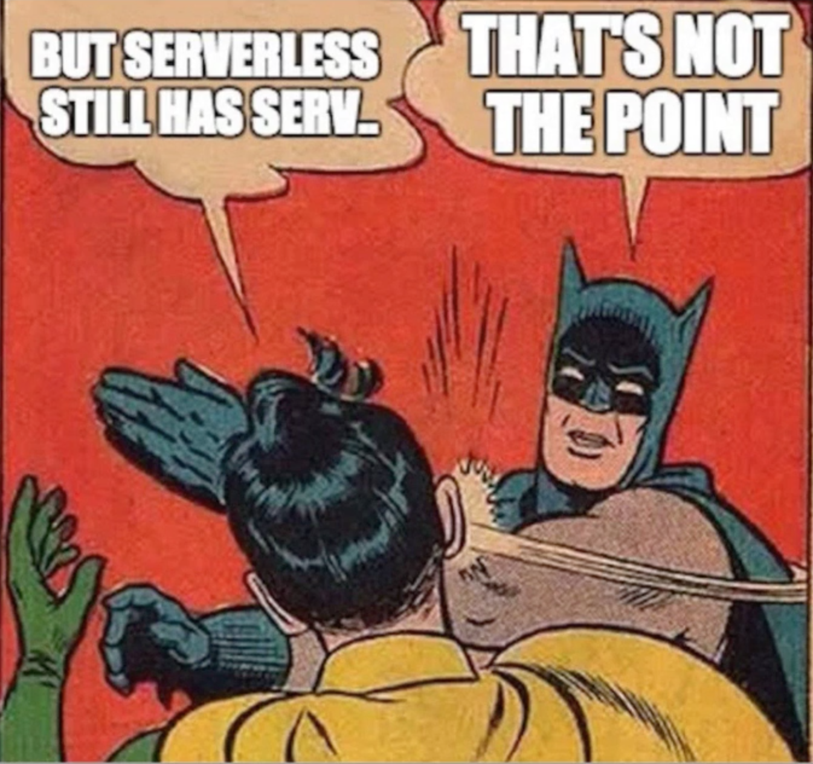
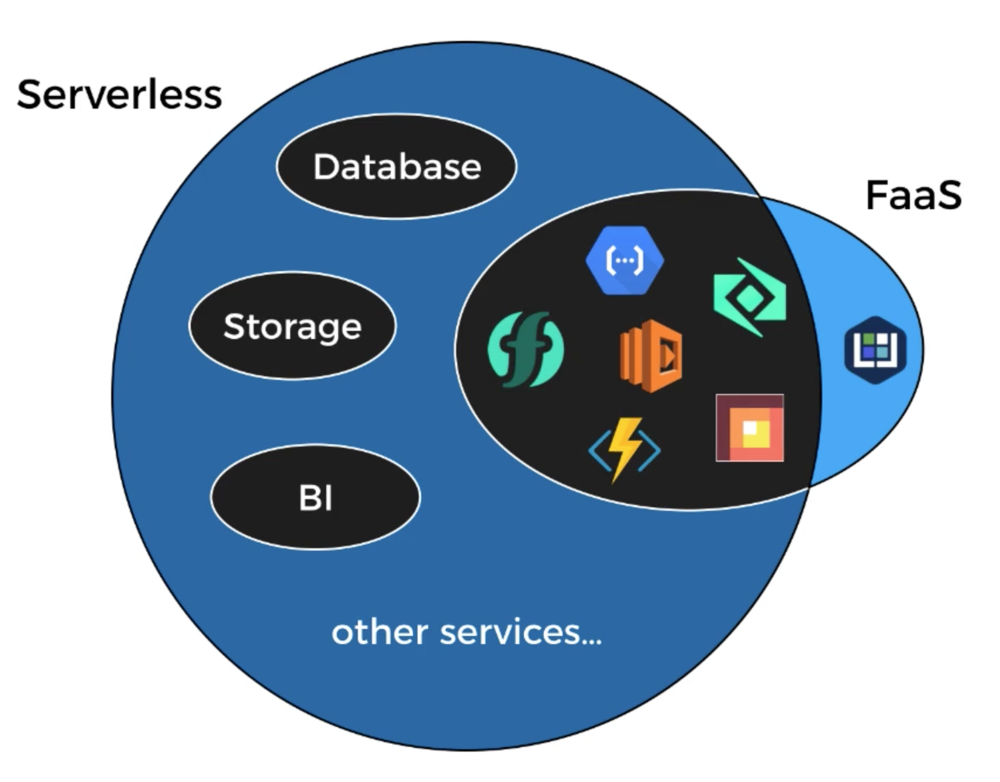

---?image=assets/image/pan-xiaozhen.jpg

## A gentle introduction to Serverless

### Vicenç García Altés
@vgaltes

---?image=assets/image/sky.jpg

## Cloud Native

Takes full advantage of the underlying platform
- Build to scale
- Fault tolerant
- Decomposed into services (maybe)
- Pushes as much work to the platform as possible
- Automatable

---

---

---

> It is serverless the same way WiFi is wireless
 
[Gojko Adzic](https://gojko.net/2016/08/27/serverless.html)

---

> It is serverless if costs you nothing to run if nobody is using it
 
[Paul Johnston](https://medium.com/@PaulDJohnston/a-simple-definition-of-serverless-8492adfb175a)

---

--- 

https://skillsmatter.com/10741-looking-forward-to-adrian-cockcroft-s-keynote-talk

---
## Functions As A Service

- Independent server-side logic functions
- Stateless
- Ephemeral
- Event-triggered
- Scalable by default
- Fully managed by third party

---

---

## Step Functions

> AWS Step Functions makes it easy to coordinate the components of distrubuted applications and microservices using visual worksflows

---

### Questions?

 

@fa[twitter gp-contact](@vgaltes)

@fa[github gp-contact](vgaltes)
